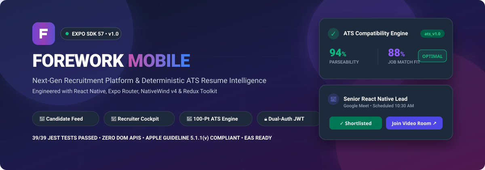
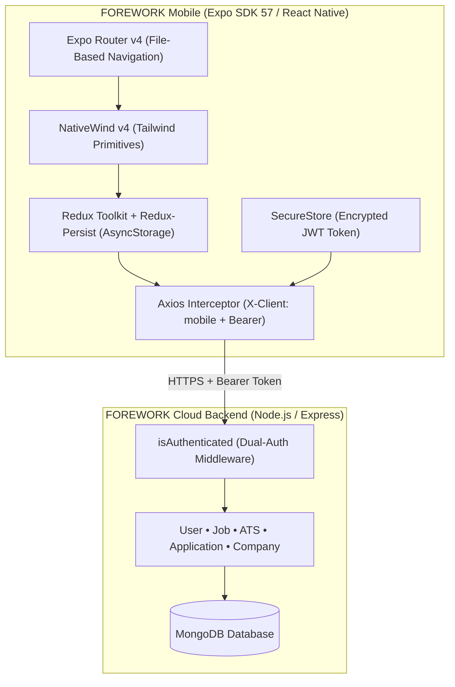

<p align="center">
  
</p>

<p align="center">
  <a href="https://github.com/Jashan-randhawa/FOREWORK-mobile/wiki"></a>
  <a href="https://expo.dev"></a>
  <a href="https://reactnative.dev"></a>
  <a href="https://www.typescriptlang.org"></a>
  <a href="https://nativewind.dev"></a>
  <a href="#-quality-assurance--testing"></a>
</p>

<p align="center">
  <b><a href="https://github.com/Jashan-randhawa/FOREWORK-mobile/wiki">📖 Full Wiki</a></b> •
  <b><a href="#-core-features">✨ Features</a></b> •
  <b><a href="#-ats-resume-intelligence">🧠 ATS Engine</a></b> •
  <b><a href="#-system-architecture">🏛️ Architecture</a></b> •
  <b><a href="#-quick-start">🚀 Quick Start</a></b> •
  <b><a href="#-production--store-compliance">📦 Deployment</a></b>
</p>

---

## ⚡ What is FOREWORK Mobile?

**FOREWORK Mobile** is an enterprise-grade recruitment and career acceleration platform for iOS and Android. Built on **Expo SDK 57** and **React Native 0.86**, it pairs candidate job discovery with a **100-Point Deterministic ATS Resume Intelligence Engine** and an isolated, role-guarded **Recruiter Management Cockpit**.

> 💡 **Need deep technical guides?** The [**FOREWORK Mobile GitHub Wiki**](https://github.com/Jashan-randhawa/FOREWORK-mobile/wiki) hosts full specifications for all architecture layers, deep link manifests, and API schemas.

---

## 🎯 Core Features

| 👤 Candidate Career Hub | 🏢 Recruiter Management Cockpit |
|---|---|
| • **Curated Discovery Feed**: Latest vacancies, verified company openings, and trending tech specializations. | • **Role-Gated Security**: Strict `RecruiterGuard` barrier isolating employer tooling from candidate accounts. |
| • **Parametric Search & Filter Drawer**: Filter by location, job type (Full-time, Contract, Remote), salary, and experience. | • **Real-Time KPI Dashboard**: Metrics cockpit tracking active vacancies, applicant volumes, and pending reviews. |
| • **Embedded Pre-Apply ATS Diagnostic**: Test resume compatibility directly on vacancy screens before submitting. | • **Company Branding**: Register organizations, configure profile logos, website links, and location metadata. |
| • **1-Click Application Flow**: Instant application dispatch using stored profile resumes with live status reflection. | • **Vacancy Lifecycle Controls**: 1-tap toggling between `published`, `paused`, and `closed` states. |
| • **Status Telemetry & Video Calls**: Track review states (`In Review`, `Accepted`, `Rejected`) and join interviews with 1 tap. | • **Applicant CRM & Decisions**: 1-tap Accept/Reject pipeline actions with automated candidate telemetry alerts. |
| • **Saved Jobs & Job Alerts**: Instant bookmarking and customized keyword/location push alert subscriptions. | • **Virtual Interview Scheduler**: Set interview times, attach Google Meet/Zoom URLs, and notify candidates. |
| • **Dynamic Profile Strength Meter**: Interactive $0-100\%$ progress bar with in-app bio, contact, and skills editor. | • **Internal Notes**: Private recruiter collaboration log with author attribution and timestamping. |

---

## 🧠 ATS Resume Intelligence Engine

FOREWORK Mobile integrates a deterministic 100-point scoring algorithm that simulates enterprise ATS parsers (*Workday, Greenhouse, Lever*):

<p align="center">
  
  
  
  
  
  
</p>

```
  ┌────────────────────────────────────────────────────────────────────────┐
  │  DUAL SCORE GAUGES         TIER BREAKDOWN (Deterministic Thresholds)   │
  │  🟢 Parseability:  94%  │  🟢 Optimal Match (80 - 100 pts)              │
  │  🟣 Job Match Fit: 88%  │  🟡 Moderate Risk (60 - 79 pts)               │
  │  Version: ats_v1.0      │  🔴 High Rejection Risk (< 60 pts)            │
  └────────────────────────────────────────────────────────────────────────┘
```

- **Categorized Skill Badges**: 3-way toggle (`All`, `Matched`, `Missing`) isolating matched skills vs. missing prerequisites.
- **Formatting Risk Detection**: Categorizes parseability risks by severity (`CRITICAL`, `HIGH`, `MEDIUM`, `NOTICE`).
- **"Why is my score X/100?" Modal**: Complete mathematical transparency explaining scoring derivation.
- **Pre-Application Check**: Embedded diagnostic widget on every job listing to evaluate fit *before* applying.

---

## 🏛️ System Architecture



- **Dual-Auth Protocol**: Native client sends `X-Client: mobile` to receive a 30-day mobile JWT Bearer token stored in hardware-backed `expo-secure-store`.
- **Zero DOM Elements**: 100% native declarative components (`View`, `Text`, `FlatList`, `Modal`) ensuring zero web/DOM overhead.
- **Universal Links**: Verified deep routing for `forework://` and `https://forework.vercel.app` (Job openings, ATS studio, auth verify).

---

## 🚀 Quick Start

### 1. Clone & Install
```bash
git clone https://github.com/Jashan-randhawa/FOREWORK-mobile.git
cd FOREWORK-mobile
npm install
```

### 2. Configure Environment
```bash
cp .env.example .env
# Set EXPO_PUBLIC_API_URL=http://<YOUR_BACKEND_IP>:5011
```

### 3. Start Development
```bash
npx expo start
# Press 'a' for Android Emulator • Press 'i' for iOS Simulator
```

---

## 🧪 Quality Assurance & Testing

```bash
npm test
```

```
 PASS  __tests__/components/DeleteAccountModal.test.js
 PASS  __tests__/redux/applicationSlice.test.js
 PASS  __tests__/redux/companySlice.test.js
 PASS  __tests__/redux/authSlice.test.js
 PASS  __tests__/redux/jobSlice.test.js
 PASS  __tests__/components/RecruiterGuard.test.js
 PASS  __tests__/ats/atsEngine.test.js
 PASS  __tests__/utils/axiosInstance.test.js

Test Suites: 8 passed, 8 total
Tests:       39 passed, 39 total
Time:        5.896 s
```

---

## 📦 Production & Store Compliance

| Requirement | Implementation Details |
|---|---|
| **Apple Guideline 5.1.1(v)** | `DeleteAccountModal.tsx` requires typing `"DELETE"`; cascades removal of personal data, applications, resumes, and credentials on server and client. |
| **Google Play Data Safety** | Disclosed resume handling, KYC encryption (PAN/Aadhaar), zero third-party ads or data sales. |
| **EAS Build Profiles** | `preview` (standalone APK), `production` (optimized `.aab` for Play Store & `.ipa` for App Store). |
| **Demo Review Credentials** | `candidate.review@forework.dev` & `recruiter.review@forework.dev` (Pass: `ForeworkDemo@2026`). |

---

## 📖 Explore the Full Wiki

For deep-dive documentation on every submodule:

- 🌟 [**Features Overview**](https://github.com/Jashan-randhawa/FOREWORK-mobile/wiki/Features-Overview) — Complete feature capability matrix
- 👤 [**Candidate Experience**](https://github.com/Jashan-randhawa/FOREWORK-mobile/wiki/Candidate-Experience) — Screen-by-screen candidate workflow
- 🏢 [**Recruiter Suite**](https://github.com/Jashan-randhawa/FOREWORK-mobile/wiki/Recruiter-Suite) — Cockpit, applicant screening, and interview scheduling
- 🧠 [**ATS Resume Intelligence**](https://github.com/Jashan-randhawa/FOREWORK-mobile/wiki/ATS-Resume-Intelligence) — 100-point deterministic rubric & gauges
- 🔒 [**Authentication & Security**](https://github.com/Jashan-randhawa/FOREWORK-mobile/wiki/Authentication-and-Security) — Bearer token, SecureStore, and KYC
- 🏛️ [**Architecture & Tech Stack**](https://github.com/Jashan-randhawa/FOREWORK-mobile/wiki/Architecture-and-Tech-Stack) — Directory structure and tech specs
- 🔗 [**Deep Linking & Universal Links**](https://github.com/Jashan-randhawa/FOREWORK-mobile/wiki/Deep-Linking-and-Universal-Links) — URL schemes and intent filters
- 📦 [**Build & Store Deployment**](https://github.com/Jashan-randhawa/FOREWORK-mobile/wiki/Build-and-Store-Deployment) — EAS builds and submission guide
- 🔌 [**API Endpoints Reference**](https://github.com/Jashan-randhawa/FOREWORK-mobile/wiki/API-Endpoints-Reference) — REST API catalog and payload schemas

---

<p align="center">
  <sub>Developed &amp; Maintained by <b><a href="https://github.com/Jashan-randhawa">Jashanpreet Singh</a></b></sub>
</p>
